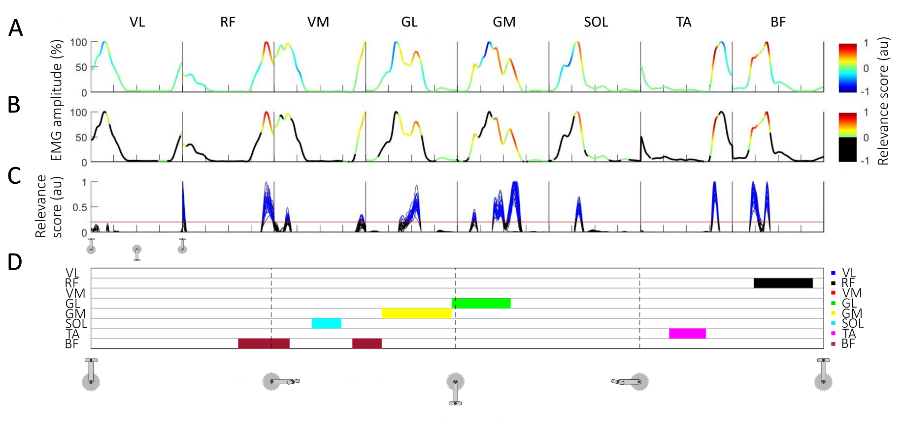

# REVEALING THE UNIQUE FEATURES OF EACH INDIVIDUAL'S MUSCLE ACTIVATION SIGNATURES



This repository contains the python code for training and evaluation of models as presented in
["Revealing the unique features of each individual's muscle activation signatures"](https://www.biorxiv.org/content/10.1101/2020.07.23.217034v1)
```
@article {aeles2020revealing,
  title = {Revealing the unique features of each individual's muscle activation signatures},
  author = {Aeles, Jeroen and
            Horst, Fabian and
            Lapuschkin, Sebastian and
            Lacourpaille, Lilian and
            Hug, Fran{\c c}ois},
  year = {2020},
  doi = {10.1101/2020.07.23.217034},
  publisher = {Cold Spring Harbor Laboratory},
  URL = {https://www.biorxiv.org/content/early/2020/07/24/2020.07.23.217034},
  journal = {bioRxiv}
}

```

## Code, Data and Reproducibility

Folder `python` contains code for model training and evaluation, based on python3 and the python sub-package of the [LRP Toolbox (version 1.3.0rc2)](https://github.com/sebastian-lapuschkin). Should you use or extend this implementation please consider citing the toolbox, as well as our paper mentioned above.
```
@article{lapuschkin2016toolbox,
    author  = {Lapuschkin, Sebastian and
               Binder, Alexander and
               Montavon, Gr{\'e}goire and
               M\"uller, Klaus-Robert and
               Samek, Wojciech},
    title   = {The LRP Toolbox for Artificial Neural Networks},
    journal = {Journal of Machine Learning Research},
    year    = {2016},
    volume  = {17},
    number  = {114},
    pages   = {1-5},
    url     = {http://jmlr.org/papers/v17/15-618.html}
}
```

In folder `python`, the file `install.sh` contains instructions to setup [`Miniconda3`](https://docs.conda.io/en/latest/miniconda.html)-based virtual environments for python, as required by our code.
Option A only considers CPU hardware, while option B enables GPU support
for neural network training and evaluation. Comment/uncomment the lines appropriately.

All recorded pedalling and walking data used in the paper is available for download [here](https://datacloud.hhi.fraunhofer.de/nextcloud/s/QSZjxQryHFTDrCd).
The folder `data` is expected to be placed in `python`, i.e. as `python/data`, and will feed the training/evaluation scripts (assuming those remain unaltered).

In addition, the folder `matlab` contains two Matlab scripts that can be used to generate data for repeating the experiments to determine the robustness of LRP relevance scores against the data used for training the models (in terms of the number of participants involved), next to other scripts used for further analyzing the LRP attributions generated by and with the trained models.

Training- and evaluation scripts for fully reproducing the data splits, models and prediction explanations are
provided with files `python/experiments_*.py`.
The folder `sge` contains files `*.args`, presenting the mentioned training-evaluation runs as (probably more) handy command line parameters, one per line, either to be called directly as
```
python experiments_setup.py ${ARGS_LINE}
```
or to be submitted to a SUN Grid Engine with
```
python sge_job_simple.py your_file_of_choice.args
```
Some paths and variables might need to be adjusted.


